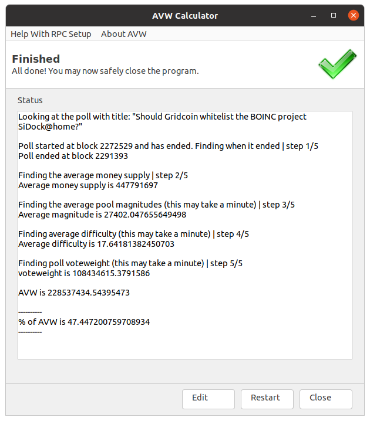

# avw-calc
Find the % of AVW of many different polls on the Gridcoin network. Works entirely
through running RPC commands on your wallet. 

Want to know how to run this? Look at [the setup section here](#setup). 

Want to know more about what AVW is? Read the [what is AVW section](#what-is-avw)

# Screenshots of the GUI Version




# Setup

1. Download the program
    * Either use the binaries in the [release tab](https://github.com/RoboticMind/avw-calc/releases) or follow the [How to Run From Python section](#how-to-run-from-python) below
    
2. Open the Gridcoin wallet and click Setting then Edit config. Add the following lines replacing things in `<>` with values:
```
server=1
rpcallowip=127.0.0.1
rpcuser=USERNAME>
rpcpassword=<PASSWORD>
```
* You will use the username and password you put as the RPC Username and RPC
password for this program

3. Restart the wallet after making those changes

4. Now run this program (make sure to leave your wallet runnning)

# How to Run From Python

1. Download or clone this repository
  * Can [download and unzip this file](https://github.com/RoboticMind/avw-calc/archive/refs/heads/main.zip)
  * Or run `git clone https://github.com/RoboticMind/avw-calc`
2. [Install Python 3 for your system](https://www.python.org/downloads/) if not already installed (make sure to check the add Python to PATH option)
3. Open a terminal 
   * On windows you can do that by pressing <kbd>Ctrl-r</kbd> then entering cmd
   * On Linux and MacOS look for something labeled terminal 
4. Find the path that your dowload of this repository is in and type and enter `cd /path/to/folder` replacing the `/path/to/folder` with the actual path
5. *If on linux*, install wxpython using the insturctions [here](https://wxpython.org/pages/downloads/index.html) or otherwise it will take much longer to instal
6. Run `pip install -r requirements.txt`
7. Now you can run `python avw-calc-gui.py` (GUI version) or `python avw-calc-cli.py` (command line version) to run the program


---

# What is AVW

Active Vote Weight (AVW) is the amount of vote weight from people that are active on the network.
Every poll type but opinion/casual requires a certain % of AVW to vote on the poll
for the results to count

In a broad sense AVW is calculated like this:

`voteweight from online coins + voteweight from magnitude - theoretical voteweight of pools (since they don't vote)`

For more information see the [active vote weight section](https://gridcoin.us/wiki/voting#active-vote-weight) of the voting wiki page